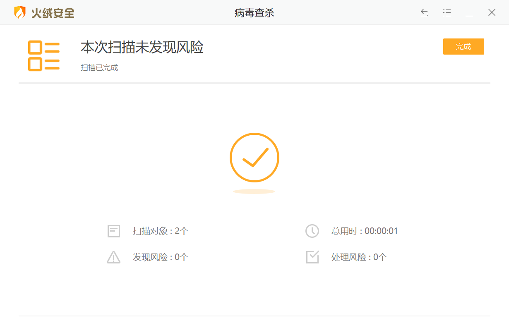
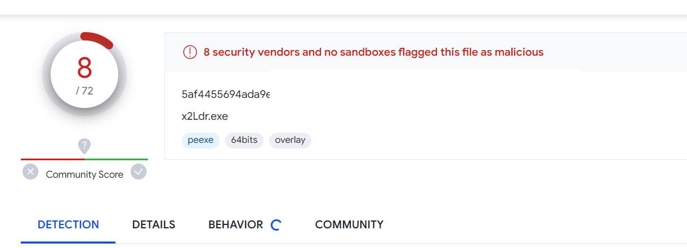
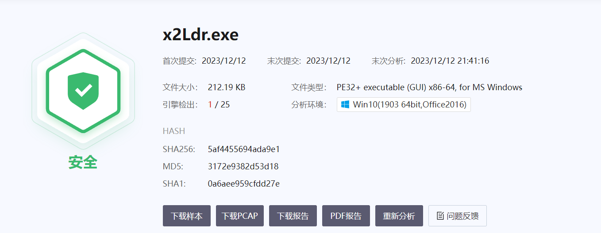
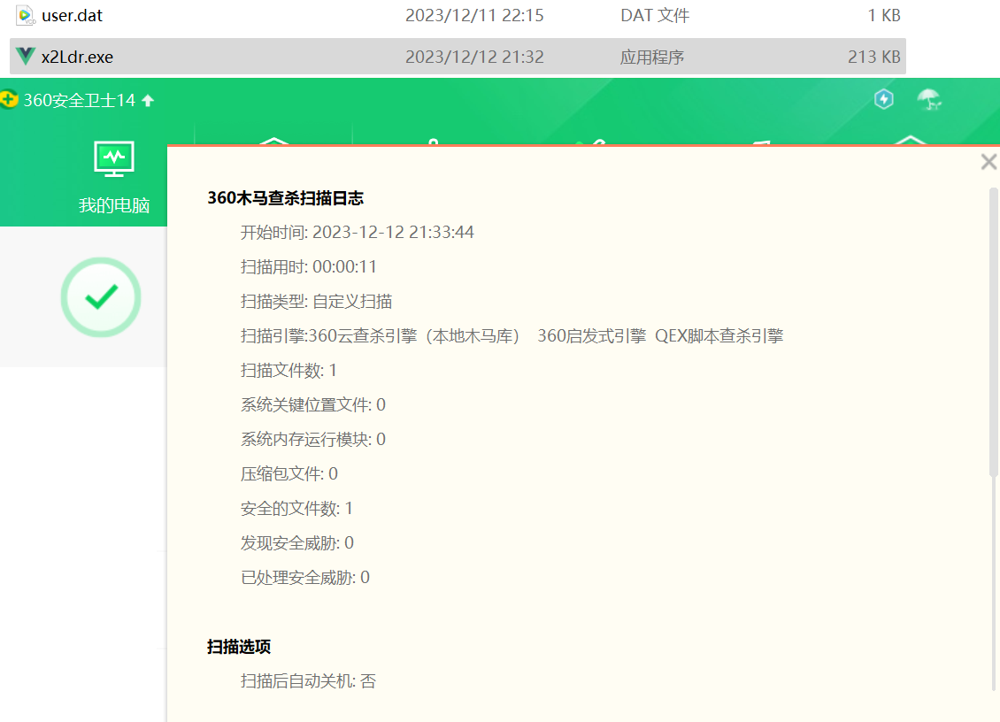
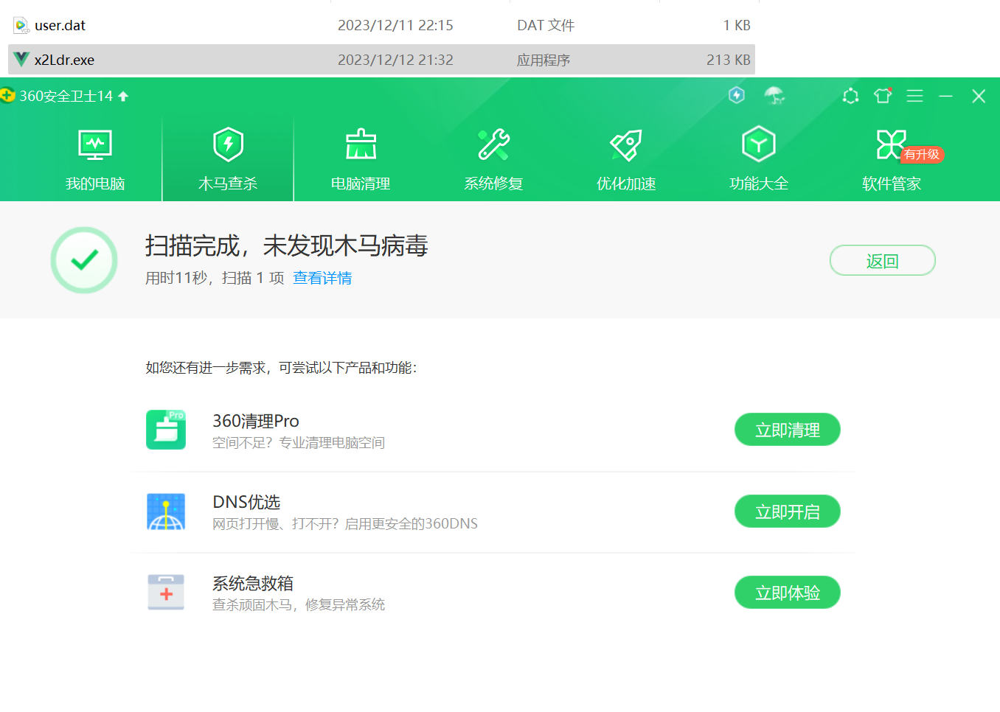

免责声明：本工具仅用于安全研究和教学目的，用户应自行承担因使用该工具而引起的一切法律和相关责任。作者不对任何法律责任承担责任。


# x2Ldr
2023年12月15日 新增一个无需分离 nim 实现的加载方式 - x2Ldr-Plus

免杀效果：火绒、360（未开核晶）均联网

读入 Msfvenom 或 Cobalt Strike 等 C2 的 Shellcode 方式分离免杀

或者配合 donut 可以将 exe、dll 转为 Shellcode 载入 MimiKatz 等工具

# 使用方法
在 windows 配置 nim 环境。
官网下载 https://nim-lang.org/install_windows.html

https://nim-lang.org/download/nim-2.0.0_x64.zip

msfvenom 生成 shellcode

```
msfvenom -a x64 -p windows/x64/exec CMD=calc -f raw -o calc_x64.bin
```

xor 加密 msfvenom 生成的 raw 格式 shellcode

```sh
> python .\xorencrypt.py .\calc_x64.bin
> xor encrypted : .\calc_encrypted.bin
```

将加密后的文件名作为参数传递给 nim 文件中的 fopen 参数

```cpp
	//修改这里
	char key[] = "key";

	//修改这里
	fp = fopen("user.dat", "rb");
```

编译

```
nim c -d=mingw --app=gui --cpu=amd64 -d:release --opt:size --passL:-static .\x2Ldr.nim
```


# 效果





## huorong



## 360




